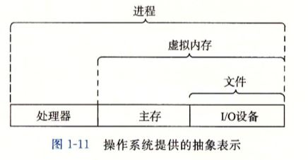

# 第1章 计算机系统漫游

标签：计算机系统

---

## 从hello.c看信息的表现形式

- hello.c源程序是以字节序列的方式存储在文件中的
- 体现了基本思想：系统中所有的信息——包括磁盘文件、内存中的程序、内存中的存放的用户数据以及网络上传输的数据，都是由一串比特表示的

---

## 编译系统的构成

- 命令：`linux> gcc -o hello hello.c `
- GCC编译器驱动程序读取源程序文件hello.c，并把它翻译成一个可执行的目标文件hello，经过四步
-> 源程序	hello.c
	- 预处理器cpp -> 根据字符#开头的命令修改原始C程序
	- 编译器ccl -> 低级机器语言指令，通用的输出语言
	- 汇编器（as）-> 翻译成机器语言指令，并打包成可重定位目标程序的格式
	- printf.o + 链接器（ld）-> 可执行目标程序(二进制) 可被加载到内存中由系统执行

> GNU项目 一个包含Unix操作系统除内核外的主要部件的环境

---

## 学习编译系统工作的益处

- 优化程序性能
	- 如对比switch语句和一系列的if-else语句效率；while和for循环的效率等
- 理解链接时出现的错误
- 避免安全漏洞
	- 如缓冲区移除错误涉及数据和控制信息存储在程序栈上的方式

---

## 系统的硬件组成

- 构成
	- 总线、I/O设备(通过一个控制器或适配器域I/O棕线相连)、主存、处理器CPU（程序计数器PC、存储器、算术\逻辑单元ALU）
- 处理器工作
	- 从系统通电到断电，处理器一直在不断执行程序计数器PC指向的指令，再更新程序计数器，使其指向下一条指令
	- CPU在指令的要求下可能会执行这些操作：
		- 加载（从主存复制一个字节或者一个字到寄存器覆盖原内容)
		- 存储（从寄存器复制一个字节或一个字到主存的某个位置覆盖原内容）
		- 操作（把两个寄存器内容复制到ALU进行算术运算并放入寄存器覆盖原内容)
		- 跳转（从指令本身抽出一个字复制到PC中覆盖原值）
	- 看似是指令集架构的简单实现，但在实际现代处理器中使用了复杂的机制来加速程序的执行

---

## 高速缓存处理器

- 产生原因
	- 执行指令系统花费大量时间复制信息，导致开销
	- 根据机械原理，主存扩大的利益比使用高速缓存处理器的效益低得多，因此系统设计者采用更小更快的存储设备存放近期可能需要得信息，加速读取
- 一个存储器层次结构的实例

---

## 操作系统管理硬件

- 操作系统提供的抽象表示
	- 并发：进程、单CPU进程指令交错执行、上下文状态、线程
	- 虚拟内存：虚拟地址空间
	
	- 文件: 字节序列，所有IO设备，包括磁盘、键盘、显示器甚至网络都可以看成是文件

---

## Amdahl定律

- 通过计算加速比S=T(old)/T(new)，得出结果——想要显著加速整个系统，必须提升全系统中相当大的部分的速度

---

## 并发和并行

- 线程级并发处理
- 指令级并发处理
- SIMD单指令多数据并行处理

---

## 计算机系统中完整抽象表示
